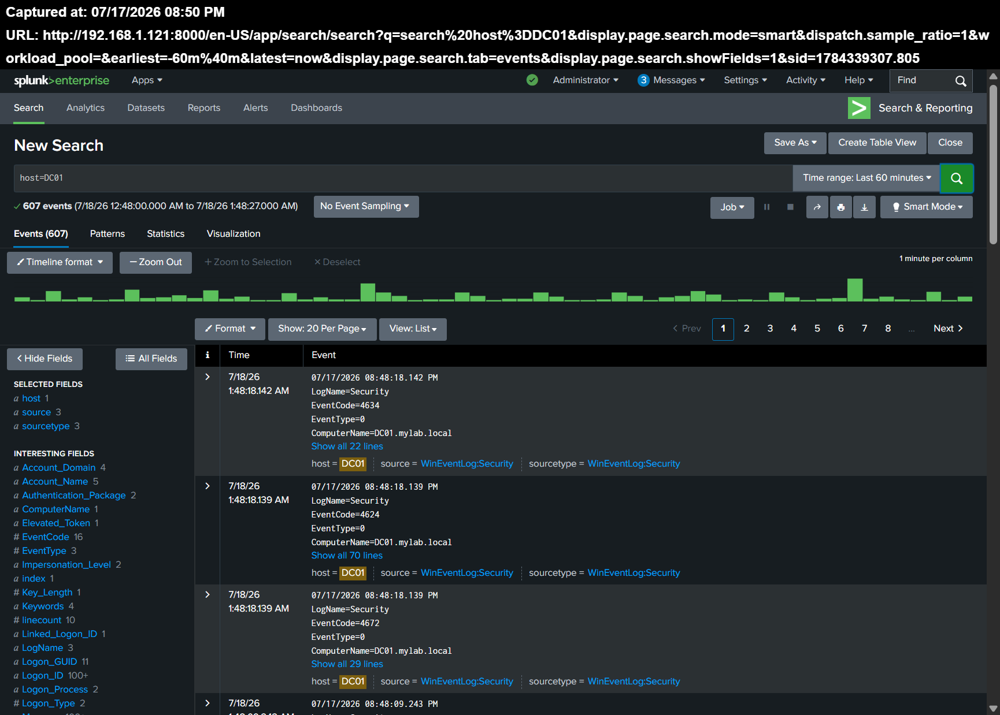
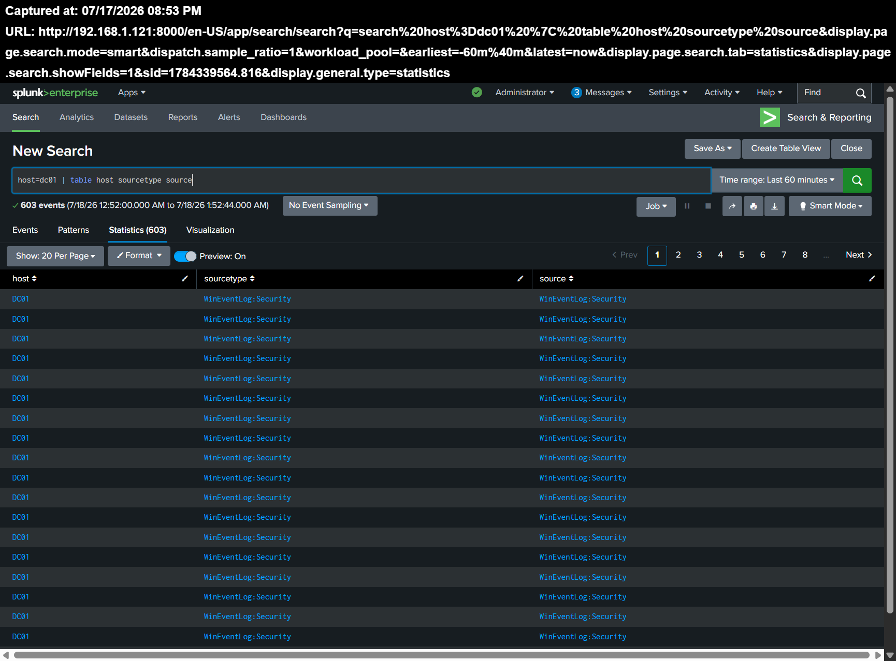
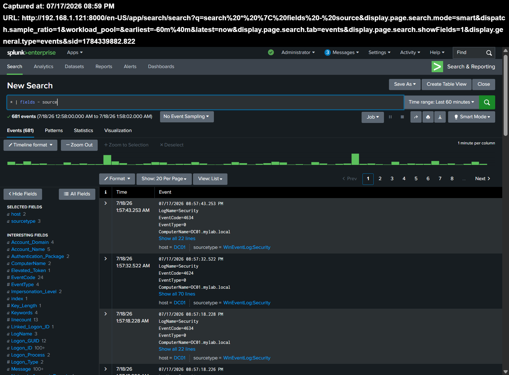
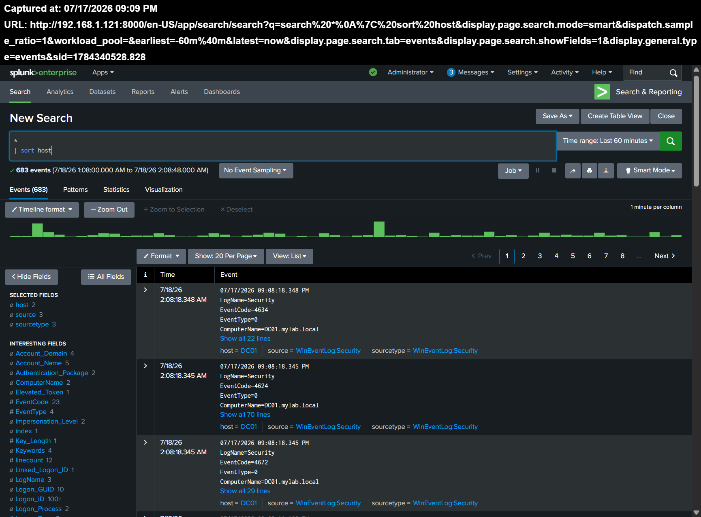
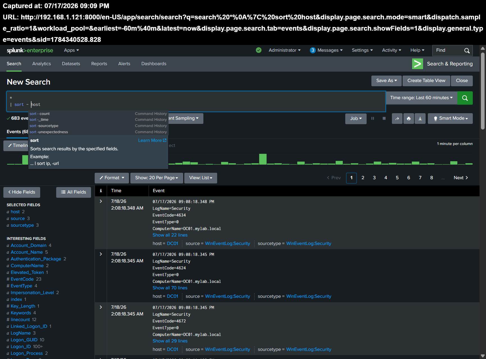
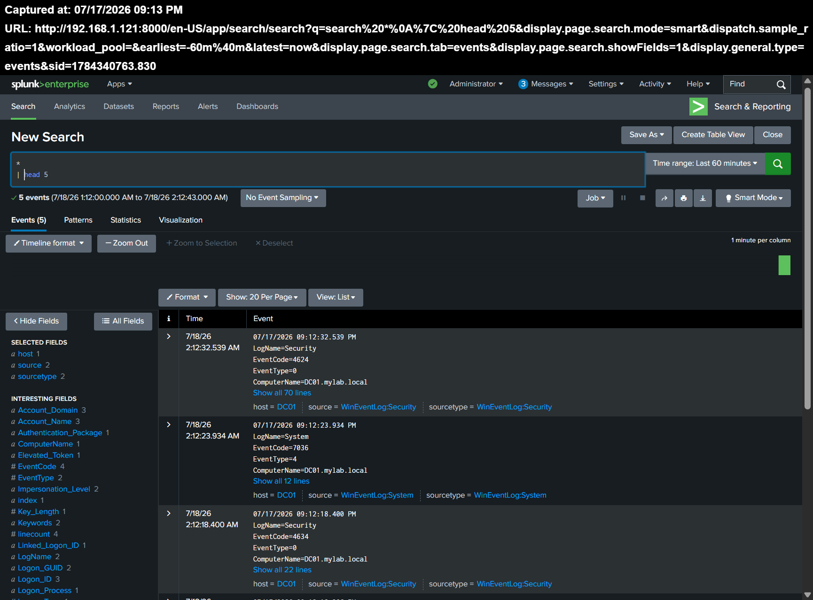
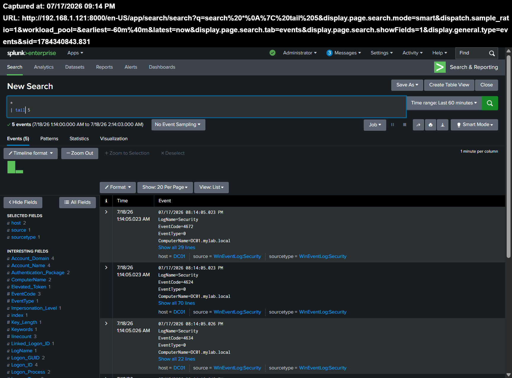

# بخش 04-03 — دستورات پایه SPL

## نمای کلی

### خلاصه

| مورد | توضیحات |
|------|---------|
| پروژه | دستورات پایه SPL |
| برنامه | Search & Reporting |
| بازه زمانی جستجو | ۶۰ دقیقه گذشته |
| منابع داده | لاگ‌های رویداد ویندوز |
| میزبان‌ها | DC01 و DESKTOP-S8HR81A |
| دستورات SPL | search، table، fields، sort، head، tail |
| هدف | استفاده از دستورات پایه SPL برای فیلتر کردن، قالب‌بندی، مرتب‌سازی و محدود کردن نتایج رویدادهای ویندوز |

## دستور Search

برای نمایش رویدادهای مربوط به کنترل‌کننده دامنه Windows Server 2022 از جستجوی زیر استفاده شد:

```spl
host=DC01
```

نتایج نشان داد که رویدادهای مربوط به میزبان `DC01` با موفقیت در Splunk ایندکس شده و قابل جستجو هستند.



## دستور Table

از دستور `table` برای نمایش فقط فیلدهای موردنظر در قالب یک جدول استفاده شد.

```spl
host=DC01
| table host sourcetype source
```

در این جستجو فقط ستون‌های زیر نمایش داده شدند:

- `host`
- `sourcetype`
- `source`



## دستور Fields

از دستور `fields` به همراه علامت منفی (`-`) برای حذف فیلد `source` از خط پردازش جستجو استفاده شد.

```spl
*
| fields - source
```

در نتیجه، فیلد `source` از فهرست فیلدهای موجود حذف شد، اما محتوای اصلی رویداد (`_raw`) بدون تغییر باقی ماند.



## دستور Sort

### مرتب‌سازی صعودی

برای مرتب‌سازی رویدادها بر اساس فیلد `host` به ترتیب حروف الفبا از دستور زیر استفاده شد.

```spl
*
| sort host
```



### مرتب‌سازی نزولی

با قرار دادن علامت منفی قبل از نام فیلد، ترتیب مرتب‌سازی برعکس شد.

```spl
*
| sort - host
```

در این حالت، مقدارهای فیلد `host` به صورت نزولی نمایش داده شدند.



### مرتب‌سازی بر اساس زمان

برای نمایش جدیدترین رویدادها در ابتدای نتایج از دستور زیر استفاده شد.

```spl
*
| sort - _time
```

این جستجو رویدادها را بر اساس زمان به صورت نزولی مرتب کرد.


## دستور Head

از دستور `head` برای نمایش تنها پنج رویداد اول نتایج جستجو استفاده شد.

```spl
*
| head 5
```

در نتیجه، فقط پنج رویداد ابتدایی مجموعه نتایج نمایش داده شد.



## دستور Tail

از دستور `tail` برای نمایش پنج رویداد آخر نتایج جستجو استفاده شد.

```spl
*
| tail 5
```

در نتیجه، پنج رویداد انتهایی مجموعه نتایج نمایش داده شد.



## نکات مهم

- دستور `search` برای فیلتر کردن رویدادها بر اساس شرایط مشخص استفاده می‌شود.
- نماد Pipe (`|`) خروجی یک دستور را به عنوان ورودی دستور بعدی ارسال می‌کند.
- دستور `table` فقط فیلدهای انتخاب‌شده را در قالب جدول نمایش می‌دهد.
- دستور `fields -` فیلدهای مشخص‌شده را از خط پردازش جستجو حذف می‌کند.
- دستور `sort` نتایج را بر اساس یک فیلد مشخص مرتب می‌کند.
- قرار دادن علامت منفی قبل از نام فیلد در دستور `sort` باعث مرتب‌سازی نزولی می‌شود.
- دستور `head` تعداد مشخصی از اولین نتایج را نمایش می‌دهد.
- دستور `tail` تعداد مشخصی از آخرین نتایج را نمایش می‌دهد.

## نتیجه‌گیری

در این بخش با مهم‌ترین دستورات پایه SPL آشنا شدیم. این دستورات امکان فیلتر کردن، انتخاب فیلدها، مرتب‌سازی و محدود کردن نتایج جستجو را فراهم می‌کنند و پایه اصلی تحلیل رویدادها در Splunk را تشکیل می‌دهند.
