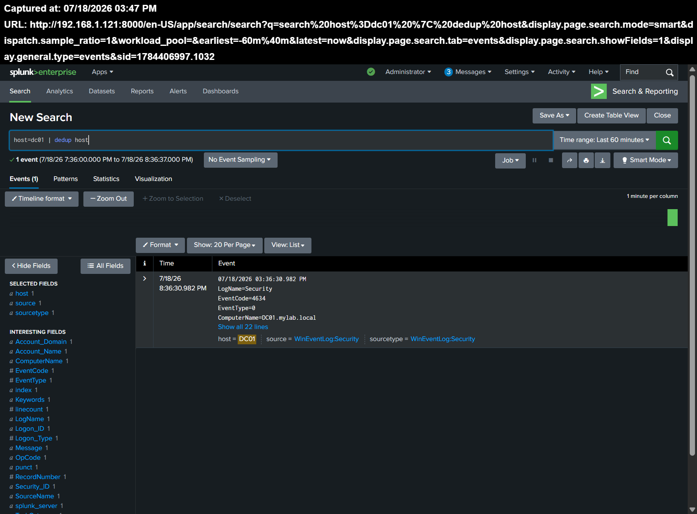
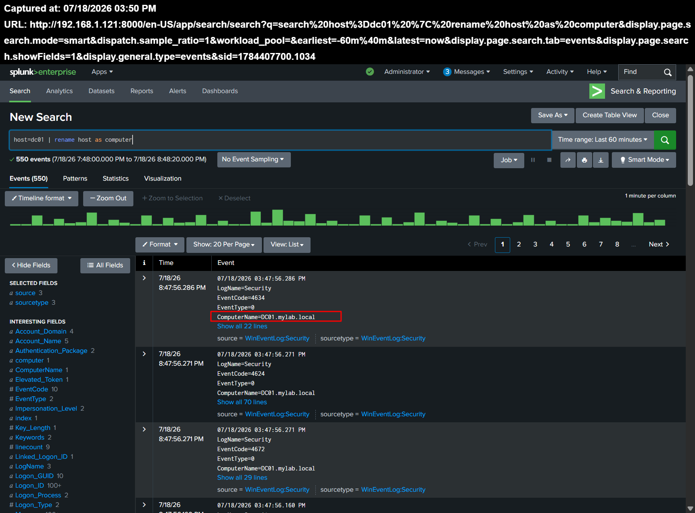
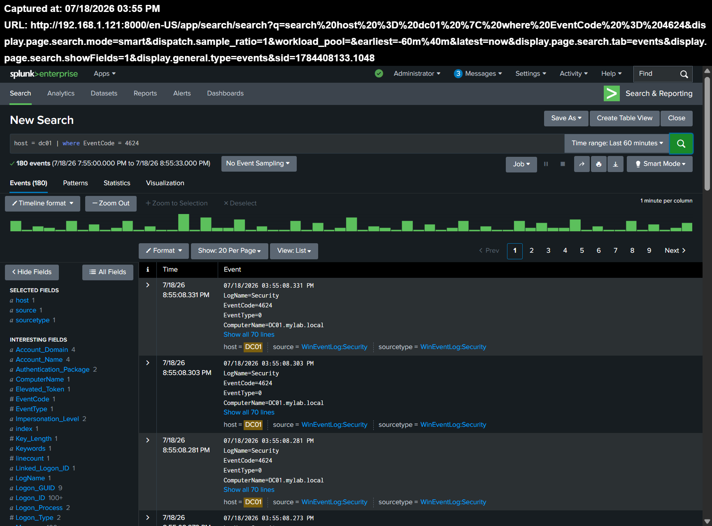

# Part 04-04 — Advanced SPL

## Overview

### Summary Table

| Item | Details |
|------|---------|
| Project | Advanced SPL Commands |
| Application | Search & Reporting |
| Search Time Range | Last 60 minutes |
| Data Source | Windows Event Logs |
| Host | DC01 |
| SPL Commands | dedup, rename, where |
| Goal | Apply advanced SPL commands to remove duplicate results, rename fields, and filter Windows Security events |

## Lab Environment

The searches in this lab were performed in the Splunk Enterprise Search & Reporting application.

The Windows Event Logs used in this lab were collected from the Windows Server 2022 domain controller with the following host name:

`DC01`

The selected search time range was:

`Last 60 minutes`

## Lab Steps

### 1. Removing Duplicate Results with dedup

The following search was executed:

```spl
host=dc01
| dedup host
```

The initial search returned Windows events generated by the `DC01` host.

The `dedup host` command removed repeated results based on the value of the `host` field. Because all returned events belonged to the same host, Splunk retained only one event.

The search result was reduced to one event representing the unique `DC01` host.



### 2. Renaming a Field with rename

The following search was executed:

```spl
host=dc01
| rename host AS computer
```

The `rename` command changed the displayed name of the `host` field to `computer` within the search results.

After the search was executed, the new field name `computer` appeared in the list of available fields.

This change affected only the results of the current search and did not permanently modify the original `host` field in Splunk.

A total of 550 events were returned during this search.



### 3. Filtering Events with where

The following search was executed:

```spl
host=dc01
| where EventCode=4624
```

The search first selected events generated by the `DC01` host.

The `where` command then evaluated the `EventCode` field and retained only events where the value was equal to `4624`.

Windows Event ID 4624 represents a successful account logon.

The filtered search returned 180 events during the selected 60-minute time range.

The results also confirmed that the events came from the Windows Security log with the following sourcetype:

`WinEventLog:Security`



## Results

The advanced SPL commands were successfully tested against Windows Event Logs collected from `DC01`.

The `dedup` command reduced repeated host results to a single unique event.

The `rename` command changed the displayed field name from `host` to `computer`.

The `where` command filtered the Windows Security events and displayed only events with Event ID 4624.

## Commands Used

```spl
host=dc01
| dedup host
```

```spl
host=dc01
| rename host AS computer
```

```spl
host=dc01
| where EventCode=4624
```

## Conclusion

This lab demonstrated the use of three advanced SPL commands in Splunk.

The `dedup` command was used to remove duplicate results based on a selected field.

The `rename` command was used to improve the readability of a field name within the search results.

The `where` command was used to apply a field-based condition and isolate successful Windows logon events with Event ID 4624.

All three searches were successfully executed, and the expected results were verified in Splunk Enterprise.
